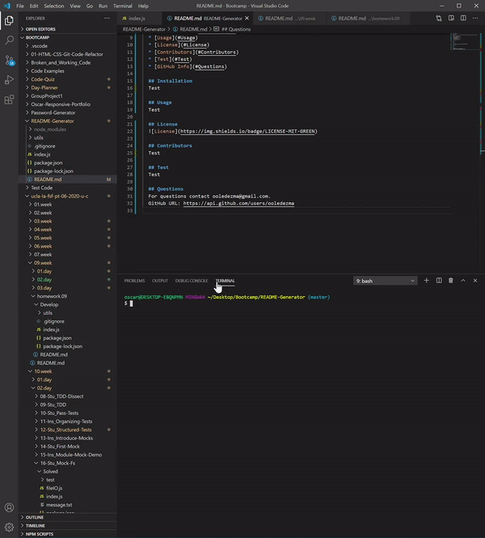
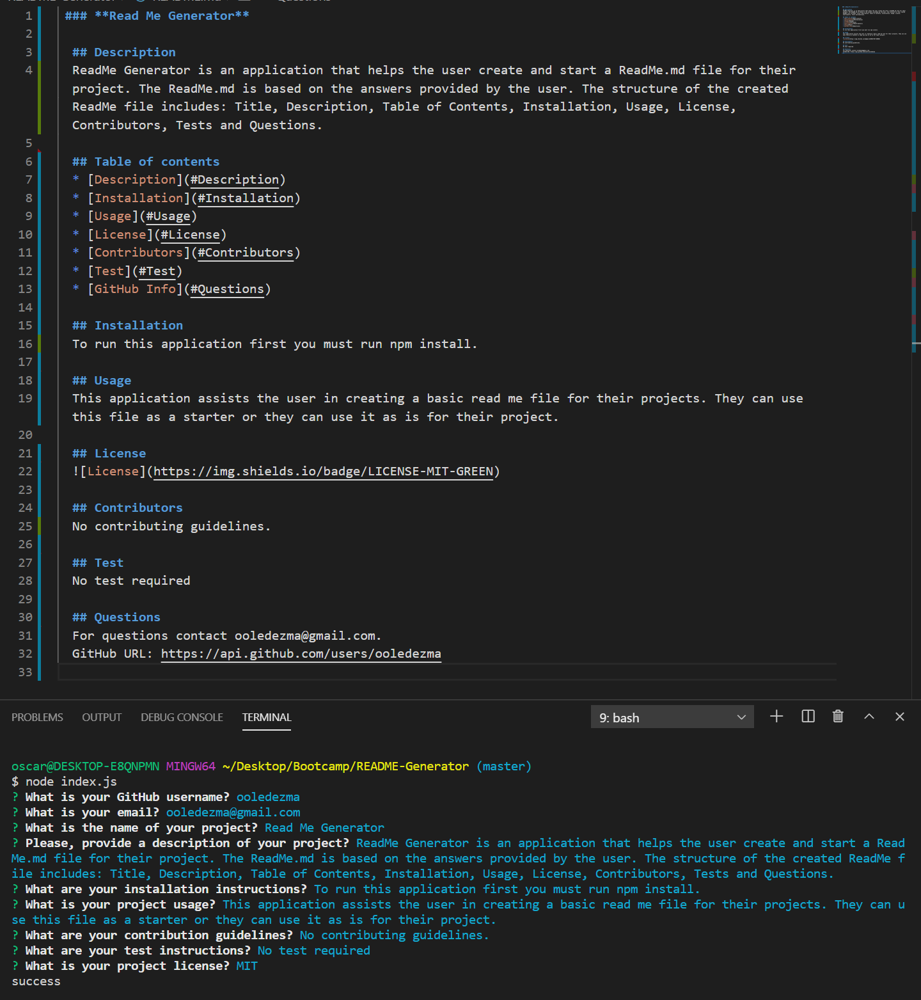

### **Read Me Generator**

## Description

ReadMe Generator is an application that helps the user create and start a ReadMe.md file for their project. The ReadMe.md is based on the answers provided by the user. The structure of the created ReadMe file includes: Title, Description, Table of Contents, Installation, Usage, License, Contributors, Tests and Questions.

## Table of contents

- [Description](#Description)
- [Installation](#Installation)
- [Usage](#Usage)
- [License](#License)
- [Contributors](#Contributors)
- [Test](#Test)
- [GitHub Info](#Questions)

## Installation

To run this application first you must run npm install.

## Usage

This application assists the user in creating a basic read me file for their projects. They can use this file as a starter or they can use it as is for their project.

## Images and Video

How it works:

Example of Readme Generated:

[Link to DEMO video](https://drive.google.com/drive/folders/1Mhrbu4z6NIE_ERAXIgZ5vLZEirzMXRoE?usp=sharing)

## License

## Contributors

No contributing guidelines.

## Test

No test required

## Questions

For questions contact ooledezma@gmail.com.
GitHub URL: https://api.github.com/users/ooledezma
